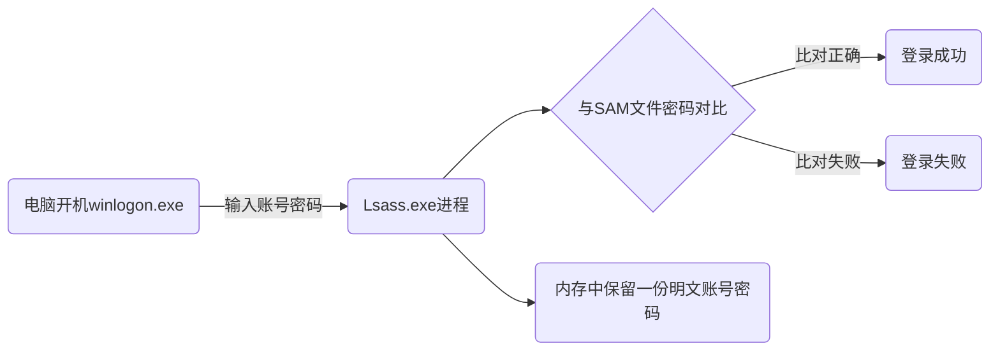
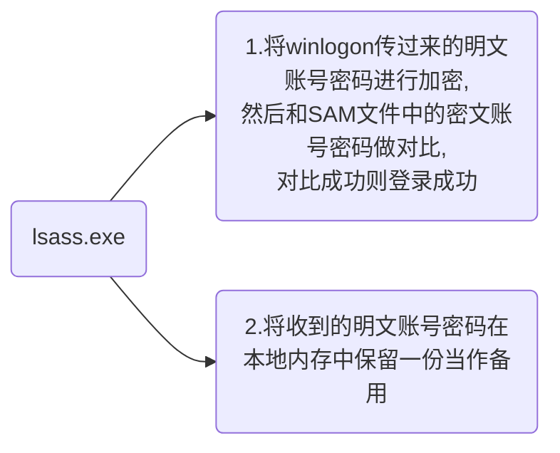

# Windows本地认证

# Windows认证机制和协议

## 0x1 本地认证

本地认证的意思就是，我们的电脑上存储着我们的账号密码，无论电脑是否联网，只要能开机，就可以输入账号密码登录到电脑中，工作组就是采用本地认证

认证的流程：

`Windows Logon Process` (即winlogon.exe)：是windows NT用户登录程序，用于管理用户登录和退出、用户注销、重启、锁屏后，操作系统会让winlogon.exe显示登录界面

`lsass.exe`是一个系统进程，用于微软windows系统的安全机制。它用于本地安全和登录策略

`SAM`文件是位于C:\Windows\System32\config目录下，用于存储本地所有用户的凭证信息，但是着不代表你可以随意去查看系统密码

普通人：不能删、不能改、不能看、不能复制

### SAM文件

SAM文件是windows的用户账号数据库，所有用户的登录名及口令等相关信息都会保存在这个文件中，简单概括如下：


格式：username:LM-HASH:NTLM-HASH


SAM文件中的密码并不是以明文的形式存在，而是加密后存储在SAM文件中

### lsass.exe

Lsass exe进程的作用非常重要，它主要负责管理本地安全策略和认证机制。这些策略包括密码策略、账户策略、用户权限、域策略等等。同时，它还负责对用户进行身份验证,以确保只有授权的用户才能访问系统资源

### LM-HASH

Windows操作系统通常使用两种方法对用户的明文密码进行加密处理。一部分为LM-HASH，另一部分为NTLM-HASH。在Windows操作系统中，HASH的结构通常如下：


username:RID:LM-HASH:NTLM-HASH。


LM Hash的全名为"LAN Manager Hash" ,是微软为了提高Windows操作系统的安全性而采用的散列加密算法其本质是`DES`加密。尽管LM Hash较容易被破解,但为了保证系统的兼容性,Windows只是将LM Hash禁用了(从Windows vista和Windows Server2008版本开始，Windows操作系统默认禁用LM Hash)。`LM Hash明文密码被限定在14位以内`，也就是说如果要停止使用LM Hash,将用户的密码设置为14位以上即可。如果LM Hash被禁用了攻击者通过工具抓取的LM Hash通常为"aad3b435b51404eead3b435b51404ee"(表示LM Hash为空值或被禁用)NTLM Hash是微软为了在提高安全性的同时保证兼容性而设计的散列加密算法。NTLMHash是基于`MD4`加密算法进行加密的。个人版从Windows vista以后,服务器版从Windows Server2003以后, Windows操作系统的认证方式均为NTLM Hash

#### 系统支持情况

| 加密类型  | 2000 |  XP  | 2003 | Vista | WIN7 | 2008 | WIN8 | 2012 | WIN10 | 2016 | WIN11 |
| :-------: | :--: | :--: | :--: | :---: | :--: | :--: | :--: | :--: | :---: | :--: | :---: |
|  LM-HASH  |  ✓   |  ✓   |  ✓   |   ✓   |      |      |      |      |       |      |       |
| NTLM-HASH |      |      |      |       |  ✓   |  ✓   |  ✓   |  ✓   |   ✓   |  ✓   |   ✓   |

#### 加密过程

1、将明文口令转换为大写形式，这里以我的明文xr@123.为例，转换成大写：

`xr@123.------->XR@123.`

2、将字符串大写后转换成16进制字符串

`XR@123.----->5852403132332E`

3、密码不足14字节要求用0补齐

`5852403132332E---->5852403132332E00000000000000`

4、将补齐的编码分成两组7字节

第一组：5852403132332E

第二组：00000000000000

5、将每一组7字节的十六进制转换为二进制，每7bit一组末尾加0， 再转换成十六进制组成得到2组8字节的编码第一组

`第一组：`

转化为二进制01011000010100100100000000110001001100100011001100101110

每组补加001011000

每组补加000101000

每组补加010010000

每组补加000000110

每组补加000010010

每组补加010010000

每组补加011001100

每组补加001011100

合并0101100000101000100100000000011000010010100100001100110001011100

转换为16进制582890061290cc5c

`第二组：`

转化为二进制00000000000000000000000000000000000000000000000000000000

每组补加000000000

每组补加000000000

每组补加000000000

每组补加000000000

每组补加000000000

每组补加000000000

每组补加000000000

每组补加000000000

合并0000000000000000000000000000000000000000000000000000000000000000

转换为16进制0000000000000000

6、将以上步骤得到的两组8字节编码，分别作为DES加密key为魔术字符串KGS!@#$%进行加密KGS!@#$%的16进制为4B47532140232425

LM-HASH:2b56571f281783bfaad3b435b51404ee

#### LM-HASH的缺陷

- 密码不区分大小写。
- 密码长度最大只能为`14个`字符。
- 根据以上的图，可以发现当我们的密码不超过`7位`时，生成的`LM hash`后面的一半是固定的为`aad3b435b51404ee`，也就是说通过观察`LM hash`，够判断用户的密码是否是大于等于`7位`。
- 哈希值没有加盐就进行验证，这使其容易受到中间人的攻击，例如哈希传递，还允许构建彩虹表。

### NTLM-HASH

NTLM Hash是微软为了在提高安全性的同时保证兼容性而设计的散列加密算法。NTLM Hash是基于MD4加密算法进行加密的。个人版从Windows vista以后服务器版从Windows Server 2003以后, Windows操作系统的认证方式均为NTLM Hash

#### 加密过程

1、将明文口令转换成十六进制的格式：xr@123.-->7872403132332e

2、将16进制转换成Unicode格式，即在每个字节之后加0x00

7872403132332e-->7800720040003100320033002e00

3、对Unicode字符串作MD4加密，生成32位的十六进制数字串

7800720040003100320033002e00-->c486a1a3f42be056c8b7da50d863b8a1

### 使用QuarksPwDump

命令：QuarksPwDump.exe --dump-hash-local

我们对比我们前面计算出来的LM-Hash 和 NTLM-HASH是否正确，这里我们看不到LM-Hash为空，是为一个固定值

### mimikatz

---

> 作者: [xunruo](https://xunruo.top)  
> URL: https://xunruo.top/post/347dee3e/  

