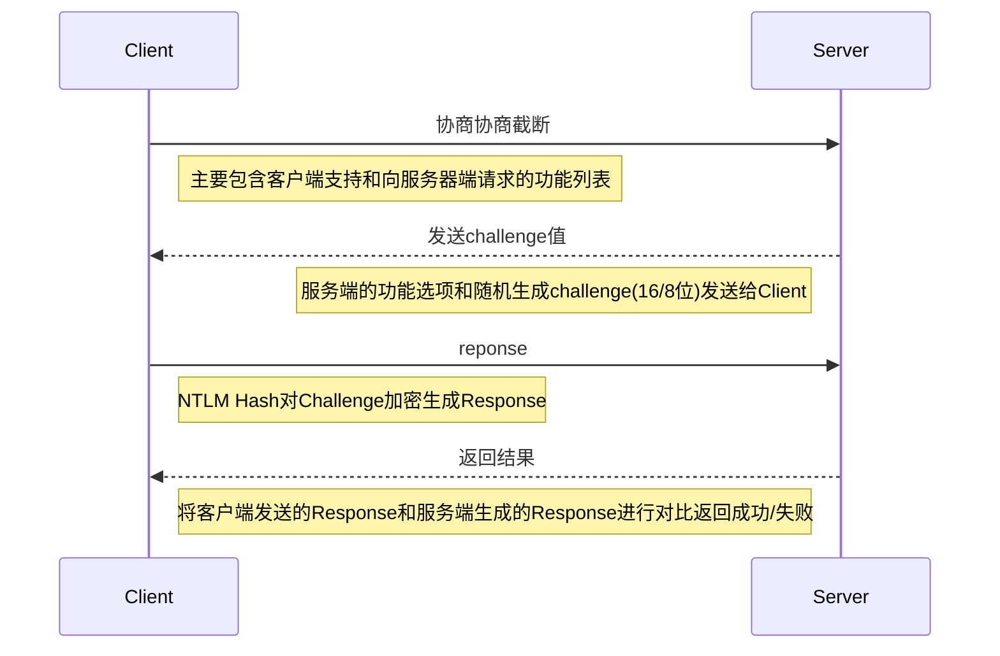

# Windwos网络认证


# 网络认证

## 0x1 概述

网络认证：Windows网络认证是指在Windows操作系统中进行网络通信和资源访问时，验证用户身份和授予权限的过程，并根据其权限级别进行授权操作。

常见网络认证：

- 用户名和密码认证
- Kerberos认证
- NTLM认证
- 密钥身份认证
- 远程桌面认证

## 0x2 NTLM协议

在平时的测试中，经常会碰到处于工作组的计算机，对于处于工作组的计算机之间是无法建立一个可信的信托机构的，只能是点对点进行信息的传输。举个例子就是，如果A想要访问主机B上的资源，就要向主机B发送一个存在于主机B上的一个账户，主机B接收以后会在本地进行验证，如果验证成功，才会允许主机A进行相应的访问。

NTLM协议是一种基于挑战（Chalenge）/相应（Response）认证机制，仅支持Windows的网络认证协议。它主要分为协商，质询和验证三个步骤

1. 协商，这个是为了解决历史遗留问题，也就是为了向下兼容，双方先确定一下传输协议的版本等各种信息。
2. 质询，这一步便是Chalenge/Response认证机制的关键之处，下面会介绍这里的步骤。
3. 验证，对质询的最后结果进行一个验证，验证通过后，即允许访问资源

### 认证流程




### 流量分析

本次实验我们使用两台windows server 2008进行NTLM认证抓包分析

| ip              | 机器                |
| --------------- | ------------------- |
| 192.168.244.166 | windows server 2008 |
| 192.168.244.199 | windows server 2008 |


开启wirkshark抓包，我们筛选协议：smb or smb2(`因为net use是建立在smb上的，所以是smb的流量`)


其中6-9号包是smb的包，10-31是NTLM认证的包，从10开始分析NTLM认证的过程

#### 1、Type1 协商

这个过程主要就是客户端向服务端发送type1阶段的消息，以开启NTLM认证，并且通过一系列选项来设置身份验证规则，如果需要，它还可以告诉服务器客户端的工作站名称以及拥有的域（绝对不会发送明文用户名）。服务器可以用这些信息来确定客户端是否符合身份验证的条件。


#### 2、Type2 质询

消息由服务器发送给客户端，响应Type1消息，主要**包含服务器生成的Challenge**，并且包含Type1消息协商时的相关信息。可以得到我们返回的challenge：da0d45fff9b7419d


#### 3、Type3 验证

客户端将使用输入的NTLM-Hash对服务器随机生成的Challenge值进行复杂的加密运算得到`Response`和`相关的账户名信息`将其作为消息发送给服务器。Response是最关键的部分是它向服务器证明了客户端知道用户的帐号密码。服务器收到客户端发送的消息，会判断用户名是本地用户还是域用户名，如果是本地用户将会在SAM中找到这个用户的NTLM-Hash，并从客户端发送的Type3消息中提取相关字段，和客户端进行几乎一样的加密运算，最后得到的Response将会和客户端发送的Response进行比较，如果一致则认证通过。如果是在域用户的话，服务器会通过Netlogon安全通道，将Response、Username、ServerChallenge转发给域控，将验证工作交给去进行，DC将会返回结果给服务器，服务器再根据DC的响应返回给客户端。


### Response生成

#### Response组成

1. 将明文密码转换为NTLM-Hash(前面有介绍NTLM Hash生成方式)
2. 将用户名转换为大写,然后和域名(域名区分大小写,但是必须和Type3包文中显示的域名一致)拼接在一起,然后进行Unicode的十六进制编码转换 (这里编码始终使用Unicode即使Flags中设置了OEM) NTLM Hash作为Key 对其进行Hmac Md5加密:HMAC_MD5(((UserName).Upper()+domainName),NTLM Hash)得到ntlm-V2-Hash
3. ServerChallenge和Blob进行拼接.使用第三步得到的ntlmV2hash对其进行加密:HMAC_MD5((ServerChallenge+Blob),ntlm-v2-hash)得到Response(NTProofStr)
4. 将Response(NTProofStr)和Blob重新进行拼接 得到NTLMv2 Response.

blob是由时间、目标信息、随机填充字符等生成。

日常使用工具抓取到的都是Net-NTLM v2 Hash的的数据

```
username::domain:challange:NTProofStr:blob
```

下面我们进行抓取实验：两台windows server 2008 + Inveigh + wireshark


需要使用powershell来运行ps1：这时候可能出现ps1无法执行禁止执行脚本，我们可以使用管理员权限poweshell执行：set-executionpolicy -executionpolicy unrestricted 降低系统的安全性，允许执行脚本


打开powershell运行

```powershell
Import-Module .\Inveigh.ps1
Invoke-Inveigh -ConsoleOutput Y -FileOutput y
```

再打开一个cmd执行

```shell
net user \\192.168.244.199 /u:administrator xr@123.
```

抓取到Net-NTLM v2 Hash


## 0x3 NTLMv1与NTLMv2区别

challenge值不同：v1：challenge的值是8位，v2:challenge的值是16位

Response加密方式不同：

NTLM v1：

1、将用户的NTLM HASH填充到42位

2、分成三组、每组14位

3、每组分别对challenge进行DES加密

4、拼接起来是Response

v1: username::hostname:LM response:NTLM response:challenge

v2：username::domain:challange:NTProofStr:blob

## 0x4 NTLM安全问题

PTH攻击、Net-NTLM hash relay攻击、Net-NTLM v1 v2 hash破解(v1比较简单，使用DES加密容易破解)


---

> 作者: [xunruo](https://xunruo.top)  
> URL: https://xunruo.top/post/93201e5f/  

